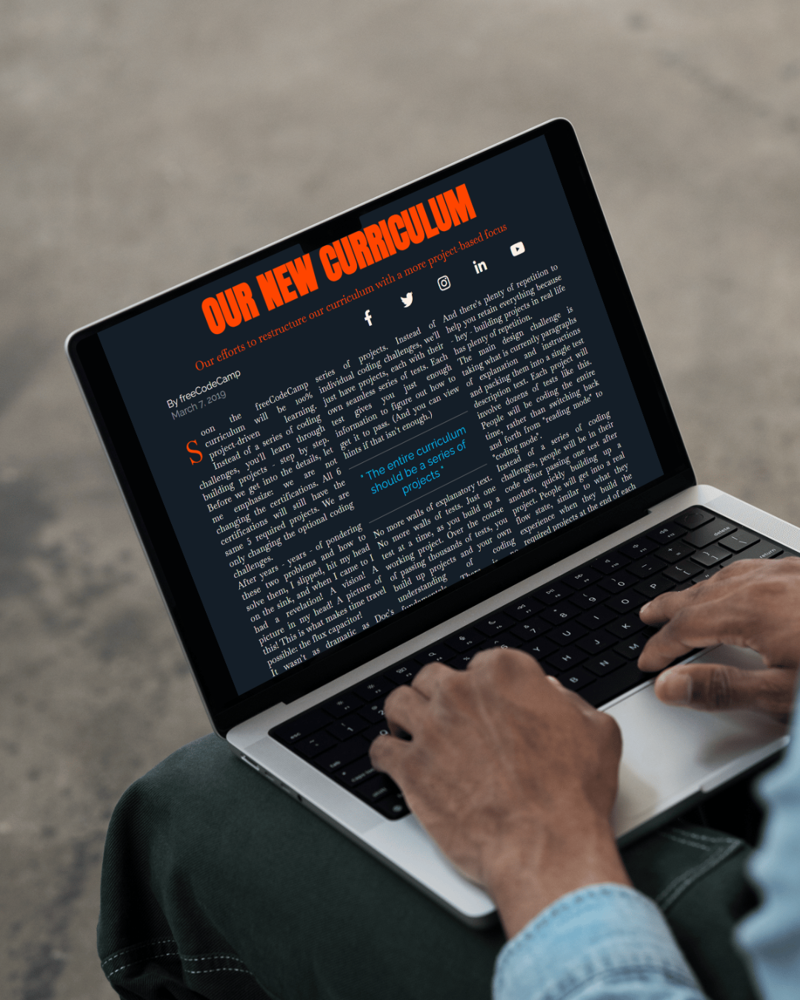

# Construindo uma Revista 📰

## Descrição

Este projeto foi criado como parte do curso de **Responsive Web Design** no **FreeCodeCamp**. O objetivo é aprender a usar o **CSS Grid**, incluindo conceitos como **grid rows** e **grid columns**, para criar um layout de revista responsivo. O layout foi projetado para ser adaptável a diferentes tamanhos de tela, utilizando **media queries** para otimizar a experiência em dispositivos móveis.

## Tecnologias Usadas

- **HTML**: Estruturação do conteúdo da página.
- **CSS**: Estilização da página, com uso de **CSS Grid** para criar o layout responsivo.
- **GitHub**: Hospedagem do projeto no repositório do GitHub.

## Plataforma

Este projeto foi realizado como parte do curso de **Responsive Web Design** oferecido pela plataforma **[FreeCodeCamp](https://www.freecodecamp.org/learn/2022/responsive-web-design/)**.

## Demo ao Vivo
Você pode ver a versão ao vivo do projeto clicando no link abaixo:

[Visualizar o projeto online](https://yancfgomes.github.io/magazine-with-css-grid/)

## Instalação

1. Clone o repositório para sua máquina local:
   ```bash
   git clone https://github.com/SeuUsuario/ConstruaUmaRevista.git
   ```

2. Navegue até o diretório do projeto:
   ```bash
   cd ConstruaUmaRevista
   ```

3. Abra o arquivo `index.html` no seu navegador para visualizar o projeto.

> **Nota:** Não é necessário configurar um servidor local para rodar este projeto. Basta abrir o arquivo HTML em seu navegador.

## Como Usar

1. Abra o arquivo `index.html` em seu navegador preferido.
2. O layout será exibido de forma responsiva, com imagens e texto organizados utilizando CSS Grid.
3. Para adaptar a visualização em dispositivos móveis, a página foi projetada para se ajustar a telas menores, utilizando media queries para ajustar o layout.

## Screenshot



## Licença

Este projeto está licenciado sob a Licença **MIT**.
